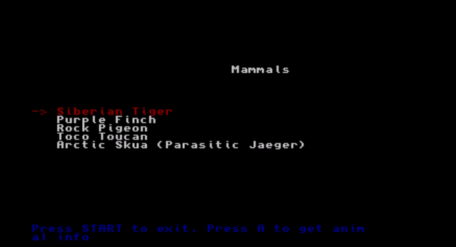
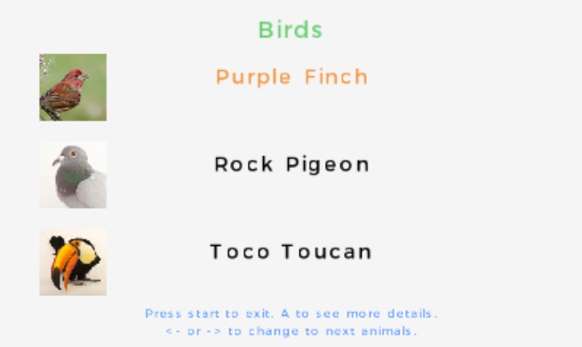

# Animal Encyclopedia for 3DS
Homebrew app for 3ds in which you can find any animal and its main characteristics

## Build

### Windows

1. Install devKitPro [devKitPro](https://github.com/devkitPro/installer/releases).
2. Open MSYS2 (which will be located at C:/devkitPro/msys2).
3. Inside MSYS2 envirnoment, navigate to your project folder.
4. Run the ``make`` command having this [Makefile](Makefile) at the root of your project folder.

### Linux

1. Install [devKitPro_pacman](https://devkitpro.org/wiki/devkitPro_pacman).
2. Run ``pacman -S 3ds-dev``.
3. As in Windows, run the ``make`` command having this [Makefile](Makefile) at the root of your project folder.

## UI

### Ugly Console UI

### Pretty UI with citro2d

In development.

